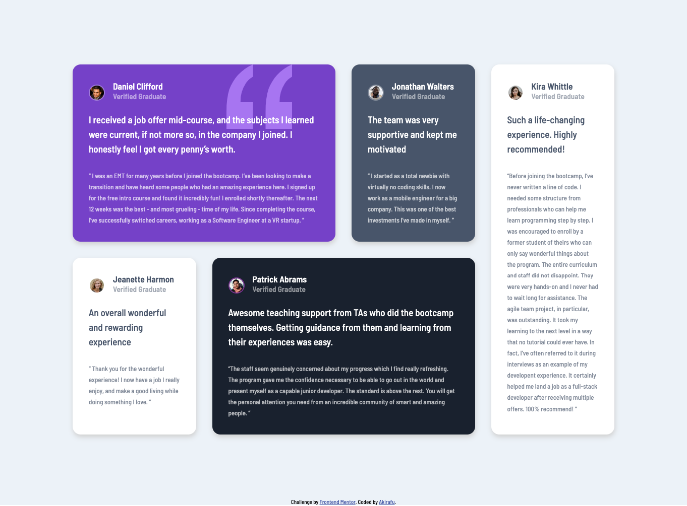
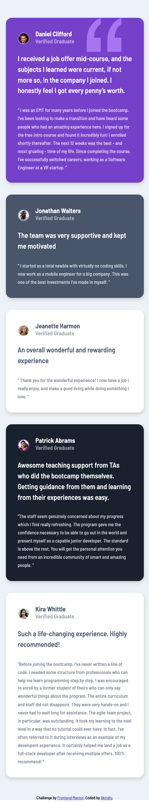

# Frontend Mentor - Testimonials grid section solution

This is a solution to the [Testimonials grid section challenge on Frontend Mentor](https://www.frontendmentor.io/challenges/testimonials-grid-section-Nnw6J7Un7). Frontend Mentor challenges help you improve your coding skills by building realistic projects.

## Table of contents

-   [Overview](#overview)
    -   [The challenge](#the-challenge)
    -   [Screenshot](#screenshot)
    -   [Links](#links)
-   [My process](#my-process)
    -   [Built with](#built-with)
    -   [What I learned](#what-i-learned)
    -   [Continued development](#continued-development)
    -   [Useful resources](#useful-resources)
-   [Author](#author)

## Overview

### The challenge

Users should be able to:

-   View the optimal layout for the site depending on their device's screen size

### Screenshot




### Links

-   Solution URL: [Add solution URL here](https://github.com/akiraafu/testimonials-grid-section)
-   Live Site URL: [Add live site URL here](https://htmlpreview.github.io/?https://github.com/akiraafu/testimonials-grid-section/blob/f3c76f5deb27e84be50e69d428d33d7712e8bb6f/index.html)

## My process

### Built with

-   Semantic HTML5 markup
-   CSS custom properties
-   Flexbox
-   CSS Grid
-   Mobile-media query

### What I learned

```css
.proud-of-this-css {
    .container {
        display: grid;
        place-items: center;
        margin: 8rem 9rem;
        grid-template-columns: repeat(4, 1fr);
        gap: 2rem;
        grid-auto-rows: minmax(120px, auto);
    }
    .five {
        height: 100%;
        grid-column-start: 4;
        grid-column-end: 5;
        grid-row-start: 1;
        grid-row-end: 3;
        background-color: var(--White);
        color: var(--VeryDarkGrayishBlue);
    }
    .container {
        grid-template-columns: 1fr;
        grid-template-areas:
            "one"
            "two"
            "three"
            "four"
            "five"
            "five"
            "five";
        margin: 3rem 1rem;
    }
}
```

### Continued development

none

### Useful resources

-   [MDN](https://developer.mozilla.org/en-US/)

## Author

-   Website - [akiraafu](https://github.com/akiraafu)
-   Frontend Mentor - [@akiraafu](https://www.frontendmentor.io/profile/akiraafu)
